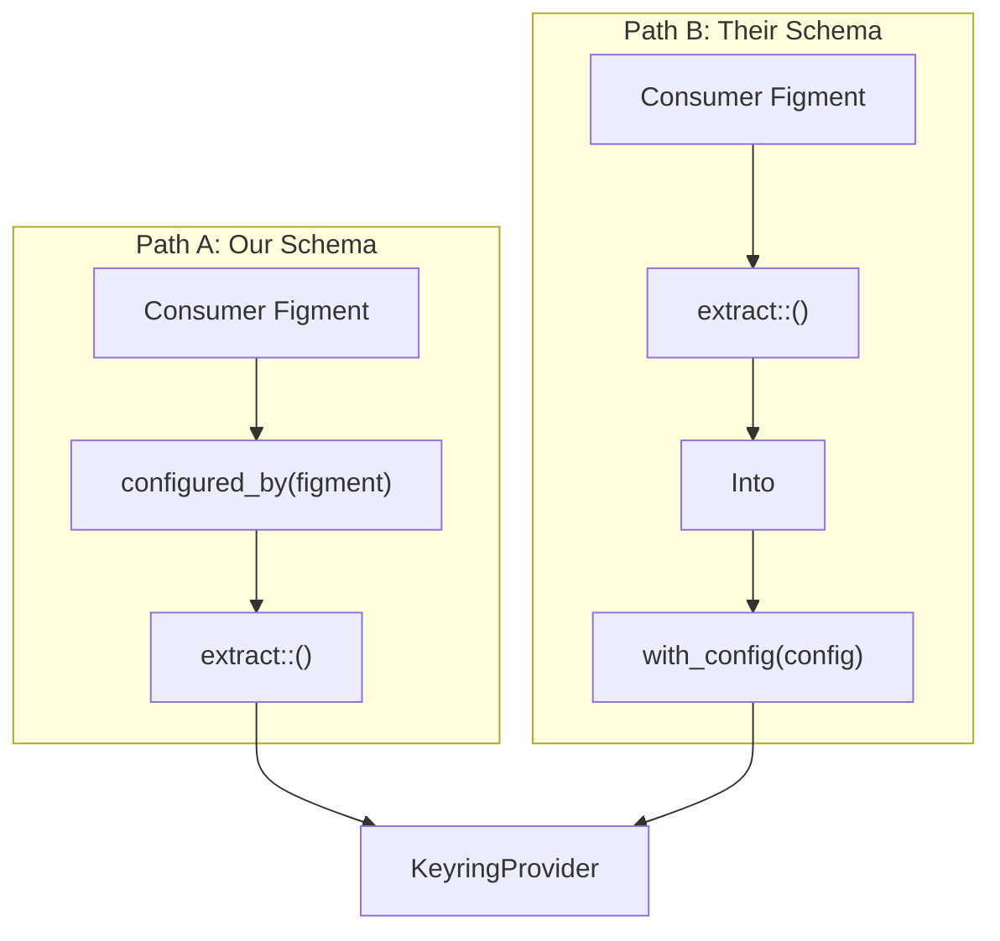
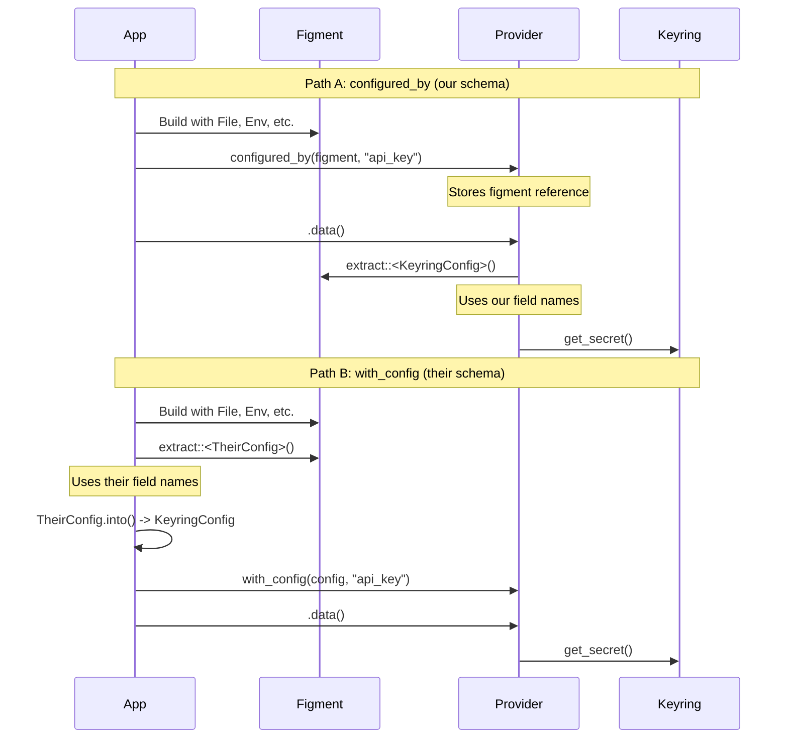

# Configurable Configuration Keys Design

**Author**: Claude (opus)  
**Status**: Draft v1  
**Supersedes**: doc/design-configurable-config.md

---

## Problem Statement

The current `KeyringProvider` requires consumers to use our fixed field names:

```toml
# Consumer MUST use these exact names
service = "myapp"
keyrings = ["user"]
optional = false
```

**Consumers want to use their own configuration schema:**

```toml
# Their existing config structure
[secrets]
application = "myapp"
stores = ["user", "system"]
fail_silently = true
```

The core requirement from the original design still holds:

> App builders use whatever layered Figment config they want to drive our keyring provider.

We extended this to include: **App builders use whatever field names they want.**

---

## Design

### Insight

We already support late binding via `configured_by(figment)`. The natural extension is to also support **direct config injection** via `with_config(config)`.



### API Addition

```rust
impl KeyringProvider {
    /// Create a provider with an explicit KeyringConfig.
    /// 
    /// Use this when you want full control over configuration schema.
    /// Extract config using your own field names, convert to KeyringConfig,
    /// and pass it here.
    /// 
    /// # Example
    /// 
    /// ```rust
    /// use figment2::Figment;
    /// use figment_keyring::{KeyringProvider, KeyringConfig, Keyring};
    /// 
    /// // Your own config structure with your own field names
    /// #[derive(Deserialize)]
    /// struct MySecretsConfig {
    ///     application: String,
    ///     stores: Vec<String>,
    ///     #[serde(default)]
    ///     fail_silently: bool,
    /// }
    /// 
    /// impl From<MySecretsConfig> for KeyringConfig {
    ///     fn from(c: MySecretsConfig) -> Self {
    ///         KeyringConfig {
    ///             service: c.application,
    ///             keyrings: c.stores.into_iter().map(|s| Keyring::from(s.as_str())).collect(),
    ///             optional: c.fail_silently,
    ///         }
    ///     }
    /// }
    /// 
    /// // Extract with your schema, convert, use
    /// let my_config: MySecretsConfig = figment.focus("secrets").extract()?;
    /// let provider = KeyringProvider::with_config(my_config.into(), "api_key");
    /// ```
    pub fn with_config(config: KeyringConfig, credential_name: &str) -> Self {
        let figment = Figment::from(Serialized::defaults(config));
        Self::configured_by(figment, credential_name)
    }
}
```

### Usage Patterns

#### Pattern 1: Use Our Schema (Existing)

For consumers who are happy with `service`, `keyrings`, `optional`:

```toml
# config.toml
[keyring]
service = "myapp"
keyrings = ["user"]
optional = false
```

```rust
let provider = KeyringProvider::configured_by(figment, "api_key")
    .focused("keyring");
```

#### Pattern 2: Bring Your Own Schema (New)

For consumers with existing config structures:

```toml
# config.toml
[secrets]
application = "myapp"
stores = ["user", "system"]
fail_silently = true
```

```rust
#[derive(Deserialize)]
struct SecretsConfig {
    application: String,
    stores: Vec<String>,
    #[serde(default)]
    fail_silently: bool,
}

impl From<SecretsConfig> for KeyringConfig {
    fn from(c: SecretsConfig) -> Self {
        KeyringConfig {
            service: c.application,
            keyrings: c.stores.into_iter()
                .map(|s| Keyring::from(s.as_str()))
                .collect(),
            optional: c.fail_silently,
        }
    }
}

let secrets: SecretsConfig = figment.focus("secrets").extract()?;
let provider = KeyringProvider::with_config(secrets.into(), "api_key");
```

#### Pattern 3: Inline Construction

For simple programmatic cases:

```rust
let provider = KeyringProvider::with_config(
    KeyringConfig {
        service: "myapp".into(),
        keyrings: vec![Keyring::User, Keyring::System],
        optional: false,
    },
    "api_key"
);
```

---

## Flow Comparison



---

## Why This Works

### 1. Zero Breaking Changes

`configured_by()` continues to work exactly as before. Existing consumers are unaffected.

### 2. Full Schema Freedom

Consumers can use any field names, any nesting structure, any serde attributes:

```rust
#[derive(Deserialize)]
#[serde(rename_all = "SCREAMING_SNAKE_CASE")]
struct LegacyConfig {
    #[serde(alias = "app")]
    service_name: String,
    
    #[serde(default = "default_stores")]
    credential_stores: Vec<String>,
}
```

### 3. Type Safety

The `From` trait implementation is checked at compile time. No runtime string matching or reflection.

### 4. Composable

Works with any Figment configuration:

```rust
// From environment
let cfg: MyConfig = Figment::new()
    .merge(Env::prefixed("MYAPP_"))
    .extract()?;

// From CLI args
let cfg: MyConfig = Figment::from(Serialized::defaults(cli_args))
    .extract()?;

// From remote config service
let cfg: MyConfig = Figment::from(RemoteConfigProvider::new())
    .extract()?;

// All work the same way
let provider = KeyringProvider::with_config(cfg.into(), "api_key");
```

---

## Implementation

```rust
impl KeyringProvider {
    /// Create a provider with an explicit KeyringConfig.
    ///
    /// This is the "bring your own schema" constructor. Extract configuration
    /// using your own struct with your own field names, implement
    /// `From<YourConfig> for KeyringConfig`, and pass it here.
    ///
    /// The config is wrapped in a Figment internally to maintain the
    /// late-binding architecture, but no further extraction occurs.
    pub fn with_config(config: KeyringConfig, credential_name: &str) -> Self {
        let figment = Figment::from(Serialized::defaults(config));
        Self::configured_by(figment, credential_name)
    }
}
```

That's it. One method, three lines of implementation.

---

## Documentation Example

Add to README or lib.rs:

```rust
//! ## Custom Configuration Schema
//!
//! If you have an existing configuration structure and don't want to use
//! our field names (`service`, `keyrings`, `optional`), use [`with_config`]:
//!
//! ```rust
//! use serde::Deserialize;
//! use figment2::Figment;
//! use figment_keyring::{KeyringProvider, KeyringConfig, Keyring};
//!
//! #[derive(Deserialize)]
//! struct MyConfig {
//!     app_name: String,
//!     secret_backends: Vec<String>,
//!     #[serde(default)]
//!     ignore_missing: bool,
//! }
//!
//! impl From<MyConfig> for KeyringConfig {
//!     fn from(c: MyConfig) -> Self {
//!         KeyringConfig {
//!             service: c.app_name,
//!             keyrings: c.secret_backends.into_iter()
//!                 .map(|s| Keyring::from(s.as_str()))
//!                 .collect(),
//!             optional: c.ignore_missing,
//!         }
//!     }
//! }
//!
//! let my_cfg: MyConfig = figment.focus("secrets").extract()?;
//! let provider = KeyringProvider::with_config(my_cfg.into(), "database_password");
//! ```
```

---

## Implementation Checklist

### P0 (Required)

- [ ] Add `KeyringProvider::with_config(config, credential_name)` method
- [ ] Add documentation with custom schema example
- [ ] Add test for `with_config` constructor

### P1 (Documentation)

- [ ] README section on custom configuration schemas
- [ ] Example showing `From` trait implementation
- [ ] Example showing environment variable mapping

---

## Alternatives Considered

### Runtime Field Aliases

```rust
pub struct FieldAliases {
    pub service: Option<String>,
    pub keyrings: Option<String>,
    pub optional: Option<String>,
}
```

**Rejected**: Requires custom deserialization logic, runtime string matching, more complex error handling. The `with_config` approach is simpler and more flexible.

### Macro-Based Schema Generation

```rust
keyring_config! {
    service => "app_name",
    keyrings => "stores",
    optional => "fail_silently",
}
```

**Rejected**: Adds complexity, requires proc-macro, less flexible than letting consumers define their own structs.

### Generic Config Type

```rust
impl<C: Into<KeyringConfig>> KeyringProvider {
    pub fn configured_by_custom<C>(figment: Figment, credential_name: &str) -> Self
    where
        C: DeserializeOwned + Into<KeyringConfig>
    { ... }
}
```

**Rejected**: Requires turbofish syntax, less ergonomic than explicit `with_config`.

---

## Conclusion

Add `with_config(config, credential_name)` to let consumers use their own configuration schema. They define a struct with their field names, implement `From<TheirConfig> for KeyringConfig`, extract with Figment, convert, and pass to us.

Simple, type-safe, zero breaking changes.

---

## Comparison with design-configurable-config.md

The revised [design-configurable-config.md](design-configurable-config.md) now correctly identifies the problem and arrives at the same solution. Both documents recommend **Solution A: `with_config()`**.

### Agreement

| Aspect | This Document | design-configurable-config.md |
|--------|---------------|-------------------------------|
| Problem | Fixed field names | Fixed field names ✓ |
| Solution | `with_config(config, credential_name)` | `with_config(config, credential_name)` ✓ |
| Implementation | 3 lines, wraps in Figment | Same approach ✓ |
| Breaking changes | None | None ✓ |
| Alternatives rejected | Field aliases, macros, generics | Field aliases, generics ✓ |

### Differences

| Aspect | This Document | design-configurable-config.md |
|--------|---------------|-------------------------------|
| `From` trait emphasis | Recommends `impl From<T> for KeyringConfig` | Shows manual struct construction |
| Examples | Shows `my_config.into()` pattern | Shows explicit field mapping |
| Arc usage | Uses `Figment` directly | Uses `Arc<Figment>` |

The `From` trait pattern is slightly more ergonomic for consumers with complex mappings, but both approaches work. The Arc difference appears to be a documentation vs implementation detail—the actual code uses `Arc<Figment>`.

### Verdict

**design-configurable-config.md is now correct.** It:
- Identifies the real problem (fixed schema, not credential mapping)
- Proposes the right solution (`with_config`)
- Provides clear examples
- Has a reasonable implementation plan

The documents are functionally equivalent. Either can serve as the implementation spec.

### Minor Suggestion

The revised document's Example 2 shows `KeyringConfig` embedded directly in consumer config:

```rust
#[derive(Deserialize)]
struct AppConfig {
    database: KeyringConfig,  // Uses our field names
    api: KeyringConfig,
}
```

This is valid but defeats the purpose—the consumer still uses our field names. Consider replacing with an example showing custom field names per-section, or note that this pattern is for consumers who *want* our schema.

---

## Additional Alternatives to Consider

### Alternative D: Serde Aliases on KeyringConfig

Add `#[serde(alias = "...")]` to support common alternative names out of the box:

```rust
#[derive(Clone, Debug, Deserialize, Serialize)]
pub struct KeyringConfig {
    #[serde(alias = "app", alias = "app_name", alias = "application")]
    pub service: String,

    #[serde(alias = "stores", alias = "backends", alias = "keyring")]
    #[serde(default = "default_keyrings")]
    pub keyrings: Vec<Keyring>,

    #[serde(alias = "allow_missing", alias = "fail_silently", alias = "ignore_missing")]
    #[serde(default)]
    pub optional: bool,
}
```

**Pros:**
- Zero consumer code changes for common aliases
- Works with existing `configured_by()` API
- Backward compatible

**Cons:**
- Can't cover all possible names
- Pollutes our type with consumer preferences
- Maintenance burden as we add more aliases
- Doesn't solve truly custom schemas

**Verdict**: Good complement to `with_config()`, not a replacement. Consider adding 2-3 obvious aliases.

---

### Alternative E: Figment Value Remapping

Use Figment's `map()` to remap keys before extraction:

```rust
impl KeyringProvider {
    pub fn with_key_mapping(
        figment: Figment,
        credential_name: &str,
        mapping: KeyMapping,
    ) -> Self {
        let remapped = figment.map(|key| {
            if key == mapping.service_key { "service".into() }
            else if key == mapping.keyrings_key { "keyrings".into() }
            else if key == mapping.optional_key { "optional".into() }
            else { key }
        });
        Self::configured_by(remapped, credential_name)
    }
}

pub struct KeyMapping {
    pub service_key: &'static str,
    pub keyrings_key: &'static str,
    pub optional_key: &'static str,
}
```

**Pros:**
- Stays within Figment ecosystem
- No manual extraction by consumer
- Declarative key mapping

**Cons:**
- Figment's `map()` operates on values, not keys (need to verify API)
- Runtime string matching
- More complex than `with_config()`

**Verdict**: Investigate Figment's actual capabilities. May not be feasible.

---

### Alternative F: KeyringConfig as Trait

Make `KeyringConfig` a trait that consumers implement:

```rust
pub trait KeyringConfigurable {
    fn service(&self) -> &str;
    fn keyrings(&self) -> &[Keyring];
    fn optional(&self) -> bool { false }
}

impl KeyringProvider {
    pub fn from_configurable<C: KeyringConfigurable>(
        config: &C,
        credential_name: &str,
    ) -> Self {
        let kc = KeyringConfig {
            service: config.service().into(),
            keyrings: config.keyrings().to_vec(),
            optional: config.optional(),
        };
        Self::with_config(kc, credential_name)
    }
}
```

**Consumer usage:**
```rust
#[derive(Deserialize)]
struct MyConfig {
    app_name: String,
    stores: Vec<Keyring>,
}

impl KeyringConfigurable for MyConfig {
    fn service(&self) -> &str { &self.app_name }
    fn keyrings(&self) -> &[Keyring] { &self.stores }
}

let my_cfg: MyConfig = figment.extract()?;
let provider = KeyringProvider::from_configurable(&my_cfg, "api_key");
```

**Pros:**
- Type-safe interface
- Clear contract
- Default implementations for optional fields

**Cons:**
- More boilerplate than `From` trait
- Another trait to learn
- `From<T> for KeyringConfig` already provides this pattern

**Verdict**: Redundant. `From` trait is idiomatic Rust and achieves the same goal.

---

### Alternative G: Deserialize from Any Map

Accept any `serde_json::Value` or `figment::value::Dict` and extract fields by configurable keys:

```rust
impl KeyringProvider {
    pub fn from_value(
        value: figment::value::Value,
        keys: FieldKeys,
        credential_name: &str,
    ) -> Result<Self, Error> {
        let dict = value.into_dict().ok_or("expected dict")?;
        let service = dict.get(&keys.service)
            .and_then(|v| v.as_str())
            .ok_or("missing service")?;
        // ... etc
    }
}

pub struct FieldKeys {
    pub service: String,
    pub keyrings: String,
    pub optional: String,
}
```

**Pros:**
- Maximum flexibility
- Works with any field names

**Cons:**
- Loses type safety
- Manual error handling
- Verbose implementation
- Reinventing serde poorly

**Verdict**: Worse than `with_config()` in every way. Rejected.

---

### Alternative H: Dual Extraction with Fallback

Try extracting with our schema, fall back to a looser schema:

```rust
impl Provider for KeyringProvider {
    fn data(&self) -> Result<Map<Profile, Dict>, Error> {
        // Try strict schema first
        let config = self.config_figment.extract::<KeyringConfig>()
            .or_else(|_| {
                // Fall back to loose schema with common aliases
                self.config_figment.extract::<LooseKeyringConfig>()
                    .map(|c| c.into())
            })?;
        // ...
    }
}

#[derive(Deserialize)]
struct LooseKeyringConfig {
    #[serde(alias = "app", alias = "application")]
    service: Option<String>,
    // ... with many aliases and all optional
}
```

**Pros:**
- Graceful degradation
- Supports multiple schemas transparently

**Cons:**
- Complex error handling
- Confusing failure modes
- Performance overhead
- Hard to debug

**Verdict**: Over-engineered. Rejected.

---

## Summary of All Alternatives

| Alternative | Complexity | Flexibility | Recommended |
|-------------|------------|-------------|-------------|
| A: `with_config()` | Low | High | **Yes** |
| B: Field Aliases builder | Medium | High | No |
| C: Generic `Into` | Medium | High | No |
| D: Serde aliases | Low | Low | **Yes (complement)** |
| E: Figment key mapping | Medium | Medium | Maybe |
| F: Trait | Medium | High | No (redundant) |
| G: Value extraction | High | High | No |
| H: Dual extraction | High | Medium | No |

## Final Recommendation

1. **Implement `with_config()`** - Primary solution for custom schemas
2. **Add common serde aliases** - Zero-effort improvement for standard variations
3. **Document `From` trait pattern** - Show idiomatic conversion approach

The combination of `with_config()` + a few serde aliases covers 99% of use cases with minimal complexity.
