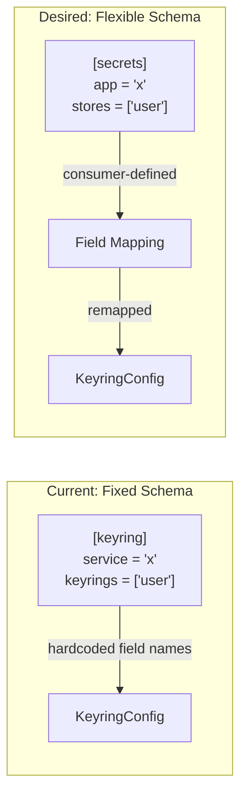

# Review: Configurable Config Design

**Reviewer**: Claude (opus)  
**Document**: doc/design-configurable-config.md  
**Status**: Needs Revision

---

## Summary

The document identifies real limitations but **misses the actual problem**. It focuses on per-keyring credential customization when the real request is about **configurable field names** in `KeyringConfig`.

---

## The Actual Problem

The design document discusses:
- Fixed credential identifier mapping
- Per-keyring usernames
- Complex lookup rules

But the user's request was:

> We need to allow applications using us to use whatever configuration keys they want, whereas we had specified fixed keys such as `keyring =` (in toml).

**Translation**: Consumers want to use their own field names, not our hardcoded `service`, `keyrings`, `optional`.

### Current State (Hardcoded Field Names)

```toml
# Consumer MUST use these exact field names
service = "myapp"
keyrings = ["user"]
optional = false
```

### Desired State (Consumer-Chosen Field Names)

```toml
# Consumer chooses their own schema
app_name = "myapp"           # maps to service
secret_stores = ["user"]     # maps to keyrings
allow_missing = false        # maps to optional
```

Or even:
```toml
# Flat structure with their own naming
keyring_service_name = "myapp"
keyring_search_order = ["user", "system"]
```

---

## Correct Problem Analysis



---

## Solution: Serde Rename with Generics

The cleanest approach is to make field names configurable at the type level.

### Option 1: Builder with Field Name Aliases

```rust
impl KeyringProvider {
    /// Configure field name aliases for configuration extraction.
    /// 
    /// Allows consumers to use their own field names instead of
    /// the default `service`, `keyrings`, `optional`.
    pub fn with_field_aliases(mut self, aliases: FieldAliases) -> Self {
        self.field_aliases = Some(aliases);
        self
    }
}

#[derive(Default)]
pub struct FieldAliases {
    /// Alternative name for `service` field
    pub service: Option<String>,
    /// Alternative name for `keyrings` field  
    pub keyrings: Option<String>,
    /// Alternative name for `optional` field
    pub optional: Option<String>,
}
```

**Usage:**
```rust
let aliases = FieldAliases {
    service: Some("app_name".into()),
    keyrings: Some("secret_stores".into()),
    optional: Some("allow_missing".into()),
};

let provider = KeyringProvider::configured_by(figment, "api_key")
    .with_field_aliases(aliases);
```

**Limitation**: Can't use serde derive with runtime aliases. Requires manual deserialization.

### Option 2: Manual Extraction with Configurable Keys

```rust
impl KeyringProvider {
    fn extract_config(&self, figment: &Figment) -> Result<KeyringConfig, Error> {
        let service_key = self.aliases.service.as_deref().unwrap_or("service");
        let keyrings_key = self.aliases.keyrings.as_deref().unwrap_or("keyrings");
        let optional_key = self.aliases.optional.as_deref().unwrap_or("optional");
        
        let service: String = figment.extract_inner(service_key)?;
        let keyrings: Vec<Keyring> = figment.find_value(keyrings_key)
            .ok()
            .and_then(|v| v.deserialize().ok())
            .unwrap_or_else(default_keyrings);
        let optional: bool = figment.find_value(optional_key)
            .ok()
            .and_then(|v| v.deserialize().ok())
            .unwrap_or(false);
        
        Ok(KeyringConfig { service, keyrings, optional })
    }
}
```

### Option 3: Consumer Provides Config Directly

Skip Figment extraction entirely for advanced use cases:

```rust
impl KeyringProvider {
    /// Create provider with explicit config (no Figment extraction).
    /// 
    /// For consumers who want full control over configuration schema.
    pub fn with_config(config: KeyringConfig, credential_name: &str) -> Self {
        let figment = Figment::from(Serialized::defaults(config));
        Self::configured_by(figment, credential_name)
    }
}
```

**Usage:**
```rust
// Consumer extracts their own way
#[derive(Deserialize)]
struct MyConfig {
    app_name: String,
    secret_stores: Vec<Keyring>,
    allow_missing: bool,
}

let my_config: MyConfig = figment.extract()?;
let keyring_config = KeyringConfig {
    service: my_config.app_name,
    keyrings: my_config.secret_stores,
    optional: my_config.allow_missing,
};

let provider = KeyringProvider::with_config(keyring_config, "api_key");
```

---

## Recommendation

**Option 3 (Consumer Provides Config)** is the cleanest:

1. **Zero complexity** - No field mapping logic
2. **Full flexibility** - Consumer controls everything
3. **Type safe** - No runtime string matching
4. **Composable** - Works with any config schema

The existing `configured_by(figment)` pattern remains for consumers who are happy with our default schema. Add `with_config(config)` for those who want full control.

```rust
// Simple case: use our schema
let provider = KeyringProvider::configured_by(figment, "api_key")
    .focused("keyring");

// Advanced case: bring your own config
let my_cfg: MySecretConfig = figment.focus("secrets").extract()?;
let provider = KeyringProvider::with_config(my_cfg.into(), "api_key");
```

---

## What the Original Document Got Wrong

| Document Claims | Reality |
|-----------------|---------|
| "Username/Key Identifier" is hardcoded | True, but not the main issue |
| "Config Key Mapping" is hardcoded | True, but `.as_key()` exists |
| Solution D "Do Nothing" is acceptable | **Wrong** - the actual problem isn't addressed |
| Complex factory pattern needed | **Wrong** - simple `with_config()` suffices |

The document analyzed secondary concerns while missing the primary request.

---

## Implementation Checklist

### P0 (Addresses Core Request)

- [ ] Add `KeyringProvider::with_config(config, credential_name)` constructor
- [ ] Document the "bring your own config" pattern
- [ ] Add example showing consumer-defined config schema

### P1 (Nice to Have)

- [ ] Add `impl From<MyConsumerConfig> for KeyringConfig` example in docs
- [ ] Consider `FieldAliases` builder for partial customization

---

## Conclusion

The configurable-config document identified symptoms but missed the disease. The fix is simple: let consumers pass a `KeyringConfig` directly instead of forcing them through our Figment extraction with fixed field names.

Add `with_config()`, document the pattern, ship it.
