# Review: GLM Design v4 (design-rewrite.glm.md)

**Reviewer**: Claude (opus)  
**Date**: 2026-02-05

---

## Summary

GLM correctly identifies that Figment should configure the keyring provider. However, **the design extracts configuration at construction time, not at `.data()` time**. This means configuration is frozen when the provider is created, not when secrets are actually fetched.

**Verdict**: Core insight correct; needs late binding.

---

## The Core Requirement

The user wants:

> App builders use whatever layered Figment config they want to drive our keyring provider.

This means:
1. User builds a Figment with File, Env, Serialized, whatever layers they choose
2. That Figment configures our keyring provider
3. **We don't dictate the source** - no hardcoded "from_file" or "from_env"

---

## What GLM Gets Right

### Figment-Driven Configuration

The insight that Figment should drive keyring configuration is correct:

```rust
// User's Figment provides keyring config
let config_figment = Figment::new()
    .merge(File::from("config.toml"))
    .merge(Env::prefixed("MYAPP_"));

// Keyring provider uses that config
let provider = KeyringProvider::from_figment(config_figment, ...);
```

### KeyringConfig as Deserializable Struct

Making `KeyringConfig` deserializable is right. It can come from any Figment source.

---

## What GLM Gets Wrong

### 1. Early Binding, Not Late Binding

GLM's `from_figment()` extracts configuration immediately at construction:

```rust
// GLM design (implicit)
pub fn from_figment(figment: &Figment, ...) -> Self {
    let config: KeyringConfig = figment.extract().unwrap(); // EXTRACTED NOW
    Self { config, ... }
}
```

This means:
- Config is frozen when provider is created
- Changes to underlying config sources don't affect the provider
- Not true late binding

**True late binding** extracts at `.data()` time:

```rust
impl Provider for KeyringProvider {
    fn data(&self) -> Result<...> {
        // Extract NOW, when secrets are actually needed
        let config: KeyringConfig = self.config_figment.extract()?;
        self.search_keyrings(&config)
    }
}
```

### 2. Confusing API Signature

```rust
KeyringProvider::from_figment(
    figment,      // For extracting config
    "myapp",      // app_name - but isn't this in the config?
    "api_key"     // credential_name
)?;
```

If `figment` provides `KeyringConfig`, why also pass `app_name`? Redundant.

### 3. Two Figment Instances Still Required

GLM's examples show:

```rust
// Figment #1 for config
let config_figment = Figment::new().merge(File::from("config.toml"));

// Figment #2 for final extraction
let final_figment = Figment::new()
    .merge(File::from("config.toml"))  // Same file again!
    .merge(provider);
```

This is awkward. Ideally, user builds ONE Figment and we use it for both config and as a merge source.

---

## The Right Design

### Provider Holds Figment, Extracts at .data() Time

```rust
pub struct KeyringProvider {
    /// Figment that provides our configuration
    /// Extracted at .data() time for late binding
    config_figment: Figment,
    
    /// Which credential to fetch
    credential_name: String,
    
    /// Optional: override config key name
    config_key: Option<String>,
}

impl KeyringProvider {
    /// Configure this provider using any Figment the app builder provides.
    /// Config is extracted at .data() time, not now.
    pub fn configured_by(figment: Figment, credential_name: &str) -> Self {
        Self {
            config_figment: figment,
            credential_name: credential_name.into(),
            config_key: None,
        }
    }
}

impl Provider for KeyringProvider {
    fn data(&self) -> Result<Map<Profile, Dict>, Error> {
        // LATE BINDING: extract config NOW
        let config: KeyringConfig = self.config_figment.extract()?;
        
        // Search keyrings using extracted config
        let secret = self.search_keyrings(&config)?;
        
        // Return as Figment data
        Ok(make_map(self.config_key_or_credential(), secret))
    }
}
```

### Usage Pattern

```rust
// App builder uses WHATEVER Figment layers they want
let config_figment = Figment::new()
    .merge(File::from("base.toml"))
    .merge(File::from("local.toml"))
    .merge(Env::prefixed("MYAPP_"))
    .merge(Serialized::defaults(SomeDefaults::new()));

// Our provider is configured by that Figment
// Config is NOT extracted yet
let keyring_provider = KeyringProvider::configured_by(
    config_figment.clone(),
    "api_key"
);

// Final Figment merges everything
let app_config: AppConfig = Figment::new()
    .merge(config_figment)      // All non-secret config
    .merge(keyring_provider)    // Secrets from keyring (extracts config HERE)
    .extract()?;
```

### Why This Works

1. **No hardcoded sources**: User provides any Figment they want
2. **Late binding**: Config extracted at `.data()` time, not construction
3. **Single source of truth**: Same Figment provides both keyring config and app config
4. **Dynamic**: If underlying sources change, next `.data()` call sees new config

---

## Comparison

| Aspect | GLM Design | Correct Design |
|--------|------------|----------------|
| Config source | User's Figment | User's Figment |
| When extracted | Construction time | `.data()` time |
| Late binding | ❌ No | ✅ Yes |
| Dynamic reconfig | ❌ No | ✅ Yes |
| API | `from_figment(figment, app_name, ...)` | `configured_by(figment, credential)` |
| Redundancy | Passes app_name separately | Config has everything |

---

## Key Insight

The fundamental difference is **when** configuration is resolved:

```mermaid
flowchart TB
    subgraph "GLM Design (Early Binding)"
        GLM_NEW["from_figment(figment, ...)"]
        GLM_EXTRACT["figment.extract()"]
        GLM_FROZEN[Config FROZEN]
        GLM_DATA["provider.data()"]
        GLM_USE[Uses frozen config]
        
        GLM_NEW --> GLM_EXTRACT --> GLM_FROZEN
        GLM_FROZEN -.->|later| GLM_DATA --> GLM_USE
    end
    
    subgraph "Correct Design (Late Binding)"
        CORRECT_NEW["configured_by(figment, ...)"]
        CORRECT_STORE[Store Figment reference]
        CORRECT_DATA["provider.data()"]
        CORRECT_EXTRACT["figment.extract()"]
        CORRECT_FRESH[Config FRESH]
        
        CORRECT_NEW --> CORRECT_STORE
        CORRECT_STORE -.->|later| CORRECT_DATA --> CORRECT_EXTRACT --> CORRECT_FRESH
    end
    
    style GLM_FROZEN fill:#8b0000,color:#fff
    style CORRECT_FRESH fill:#228b22,color:#fff
```



This enables:
- Config files can be edited between provider creation and `.data()` call
- Environment variables can change
- Same provider works across different environments
- True late binding

---

## Recommendations for GLM Design

1. **Store Figment, don't extract from it**
   - `from_figment()` should store the Figment, not extract immediately

2. **Remove redundant parameters**
   - Don't pass `app_name` if it's in the config

3. **Extract at `.data()` time**
   - This achieves true late binding

4. **Consider single-Figment pattern**
   - User's Figment can be both config source AND merged into final result
