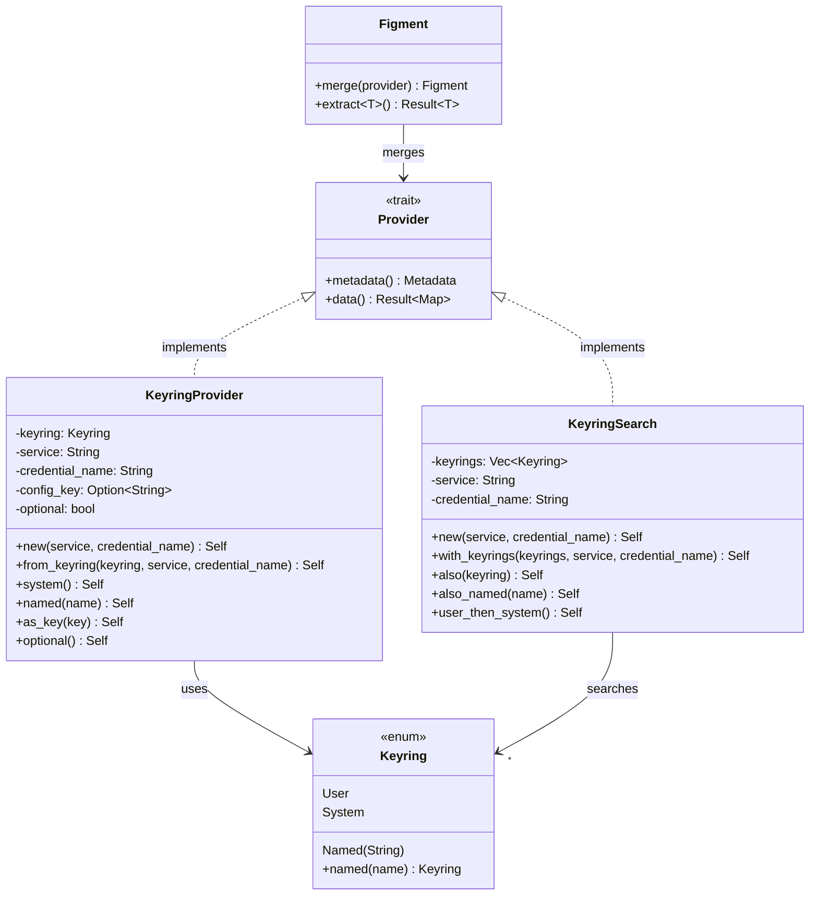
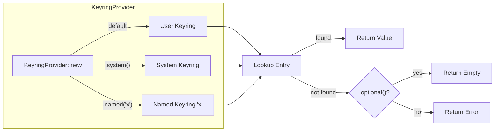
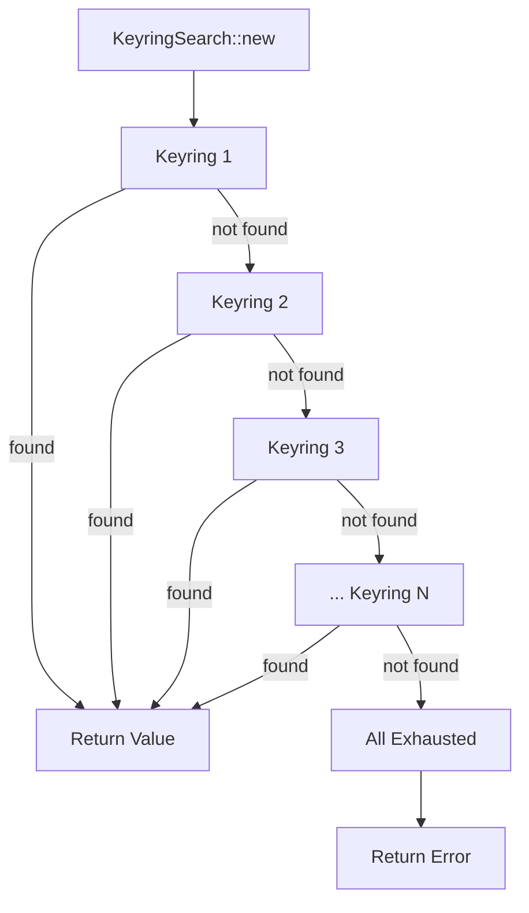
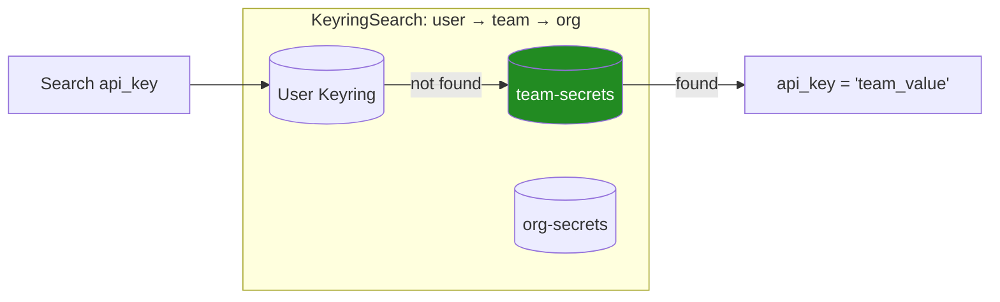
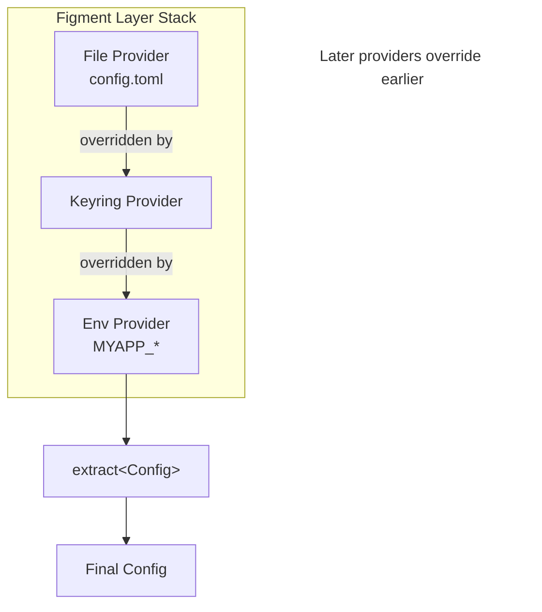
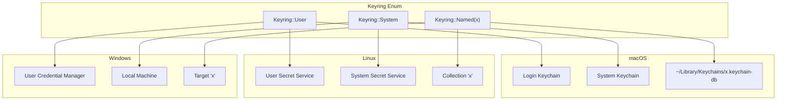
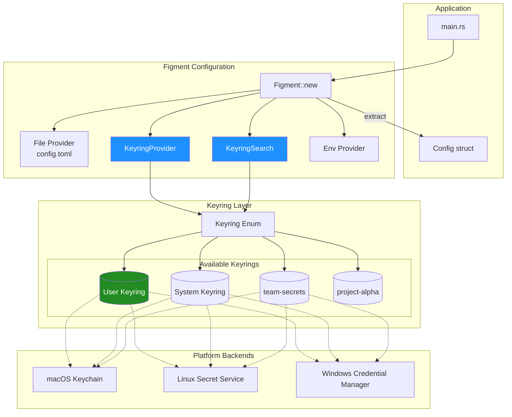
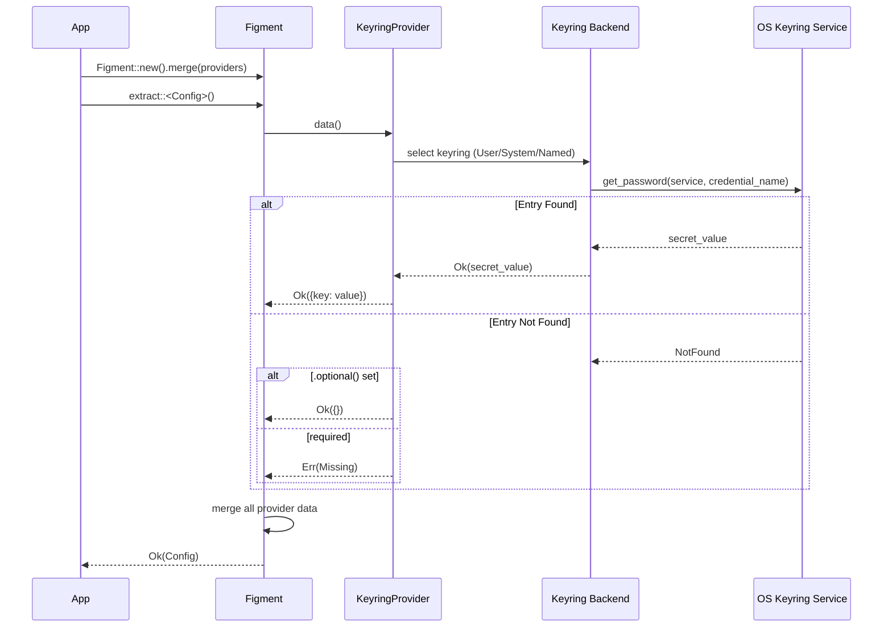

# Figment Keyring Provider - Revised Design

**Author**: Claude (opus)  
**Based on**: Cross-review synthesis + author critique  
**Status**: Draft v2

---

## Problem Statement

Applications need secure storage for sensitive configuration: API keys, tokens, database passwords. Plaintext storage in files or environment variables risks exposure through version control, process listings, logs, or file permissions.

System keyrings offer encryption at rest, session-based access control, and OS-level credential management. This provider bridges Figment2's layered configuration with system keyring storage.

---

## Design Goals

1. **Simple primary provider** - Easy to understand and use for common cases
2. **Multiple keyring support** - Search across user, system, or custom keyrings
3. **Composable keyring selection** - Use Figment itself to configure which keyrings to search
4. **User keyring by default** - Secure default; system keyring requires explicit opt-in
5. **Lazy provider (secondary)** - Future extension for deferred secret retrieval

---

## Architecture Overview



---

## Core API

### Keyring Selection

```rust
/// Identifies which keyring backend to use.
#[derive(Clone, Debug, PartialEq, Eq)]
pub enum Keyring {
    /// Current user's keyring (default, most common)
    User,
    /// System-wide keyring (requires elevated permissions on some platforms)
    System,
    /// Custom keyring by name (platform-specific interpretation)
    Named(String),
}

impl Default for Keyring {
    fn default() -> Self {
        Keyring::User
    }
}

impl Keyring {
    /// Create a named keyring.
    pub fn named(name: impl Into<String>) -> Self {
        Keyring::Named(name.into())
    }
}

impl From<&str> for Keyring {
    fn from(s: &str) -> Self {
        match s {
            "user" => Keyring::User,
            "system" => Keyring::System,
            name => Keyring::Named(name.into()),
        }
    }
}
```

### KeyringProvider

```rust
pub struct KeyringProvider {
    keyring: Keyring,
    service: String,
    credential_name: String,
    config_key: Option<String>,
    profile: Option<Profile>,
    optional: bool,
}

impl KeyringProvider {
    /// Create a provider for a single keyring entry.
    /// Uses the user keyring by default.
    pub fn new(service: &str, credential_name: &str) -> Self;
    
    /// Create a provider using a specific keyring.
    pub fn from_keyring(keyring: impl Into<Keyring>, service: &str, credential_name: &str) -> Self;
    
    /// Use the system keyring instead of user keyring.
    pub fn system(self) -> Self;
    
    /// Use a named keyring.
    pub fn named(self, name: impl Into<String>) -> Self;
    
    /// Use a specific keyring.
    pub fn keyring(self, keyring: impl Into<Keyring>) -> Self;
    
    /// Map keyring entry to a different config key name.
    pub fn as_key(self, key: &str) -> Self;
    
    /// Target a specific Figment2 profile.
    pub fn with_profile(self, profile: Profile) -> Self;
    
    /// Don't fail if entry is missing.
    pub fn optional(self) -> Self;
}
```

### Basic Usage

```rust
// User keyring (default) - most common case
KeyringProvider::new("myapp", "api_key")

// Explicit system keyring
KeyringProvider::new("myapp", "shared_secret").system()

// Named keyring - team shared keyring
KeyringProvider::new("myapp", "api_key").named("team-secrets")

// Named keyring - alternative syntax
KeyringProvider::from_keyring("team-secrets", "myapp", "api_key")

// Named keyring - explicit enum
KeyringProvider::new("myapp", "api_key")
    .keyring(Keyring::named("team-secrets"))
```

### KeyringProvider Flow



### Named Keyring Examples

Named keyrings enable team/project-specific credential collections:

```rust
// Development team's shared secrets
KeyringProvider::new("myapp", "staging_api_key")
    .named("dev-team")

// Production secrets in isolated keyring
KeyringProvider::new("myapp", "prod_api_key")
    .named("prod-secrets")

// Per-project keyrings
KeyringProvider::new("myapp", "db_password")
    .named("project-alpha")
```

---

## Multi-Keyring Search

### KeyringSearch Provider

For searching across multiple keyrings in priority order:

```rust
pub struct KeyringSearch {
    keyrings: Vec<Keyring>,
    service: String,
    credential_name: String,
    config_key: Option<String>,
    profile: Option<Profile>,
}

impl KeyringSearch {
    /// Search keyrings in order until entry is found.
    /// Default: searches user keyring only.
    pub fn new(service: &str, credential_name: &str) -> Self;
    
    /// Create with explicit keyring list.
    pub fn with_keyrings(
        keyrings: impl IntoIterator<Item = impl Into<Keyring>>,
        service: &str,
        credential_name: &str,
    ) -> Self;
    
    /// Add a keyring to the search path.
    pub fn also(self, keyring: impl Into<Keyring>) -> Self;
    
    /// Add a named keyring to the search path.
    pub fn also_named(self, name: impl Into<String>) -> Self;
    
    /// Search user keyring, then system keyring.
    pub fn user_then_system(self) -> Self;
    
    /// Search system keyring, then user keyring.
    pub fn system_then_user(self) -> Self;
    
    pub fn as_key(self, key: &str) -> Self;
    pub fn with_profile(self, profile: Profile) -> Self;
}
```

### Search Usage

```rust
// Search user keyring only (default)
KeyringSearch::new("myapp", "api_key")

// Search user first, fall back to system
KeyringSearch::new("myapp", "api_key").user_then_system()

// User → named team keyring → system
KeyringSearch::new("myapp", "api_key")
    .also_named("team-secrets")
    .also(Keyring::System)

// Named keyrings only (no user/system)
KeyringSearch::with_keyrings(
    ["project-alpha", "shared-secrets"],
    "myapp",
    "api_key",
)

// Complex search path from config
let keyrings = vec!["user", "team-secrets", "org-secrets", "system"];
KeyringSearch::with_keyrings(keyrings, "myapp", "api_key")
```

### Search Order Patterns

```rust
// Personal dev overrides → team defaults → org defaults
KeyringSearch::new("myapp", "api_key")
    .also_named("team-secrets")
    .also_named("org-secrets")

// Project-specific → user fallback
KeyringSearch::with_keyrings(["project-alpha"], "myapp", "db_password")
    .also(Keyring::User)

// Prod deployment: system only, no user secrets
KeyringSearch::with_keyrings([Keyring::System], "myapp", "api_key")
```

### KeyringSearch Flow



### Example: Team Development Search



---

## Figment-Configured Keyring Selection

The keyring search path itself can be configured via Figment, enabling deployment-specific keyring selection:

### Configuration Schema

```rust
#[derive(Deserialize)]
pub struct KeyringConfig {
    /// Which keyrings to search, in order
    /// Default: ["user"]
    #[serde(default = "default_keyrings")]
    pub keyrings: Vec<String>,
}

fn default_keyrings() -> Vec<String> {
    vec!["user".into()]
}
```

### Config File

```toml
# config.toml
[secrets]
keyrings = ["user", "system"]  # Search user first, then system

# Or for a shared server:
# keyrings = ["system"]
```

### Integration

```rust
// Load keyring config from Figment, then use it to configure secret retrieval
let base_config: KeyringConfig = Figment::new()
    .merge(File::from("config.toml"))
    .merge(Env::prefixed("MYAPP_SECRETS_"))
    .extract()?;

// Build keyring search from config
let keyrings: Vec<Keyring> = base_config.keyrings
    .iter()
    .map(|s| match s.as_str() {
        "user" => Keyring::User,
        "system" => Keyring::System,
        name => Keyring::Named(name.into()),
    })
    .collect();

// Now load secrets using configured keyrings
let config: AppConfig = Figment::new()
    .merge(File::from("config.toml"))
    .merge(KeyringSearch::new("myapp", "api_key")
        .with_keyrings(keyrings.clone()))
    .merge(KeyringSearch::new("myapp", "db_password")
        .with_keyrings(keyrings))
    .extract()?;
```

---

## Layer Integration

### Figment Merge Order



### Usage Patterns

```rust
// Pattern A: User keyring as secure fallback
Figment::new()
    .merge(File::from("config.toml"))
    .merge(KeyringProvider::new("myapp", "api_key").optional())
    .merge(Env::prefixed("MYAPP_"))
    .extract()?;

// Pattern B: Search user then system, env overrides all
Figment::new()
    .merge(File::from("config.toml"))
    .merge(KeyringSearch::new("myapp", "api_key").user_then_system())
    .merge(Env::prefixed("MYAPP_"))
    .extract()?;

// Pattern C: System keyring for shared server deployments
Figment::new()
    .merge(File::from("config.toml"))
    .merge(KeyringProvider::new("myapp", "api_key").system())
    .extract()?;
```

---

## Error Handling

| Error Type | Behavior | Notes |
|------------|----------|-------|
| Entry not found | Recoverable if `.optional()` | For KeyringSearch, tries next keyring first |
| Permission denied | Fatal | Security issue, especially for system keyring |
| Keyring unavailable | Recoverable if `.optional()` | Common in headless environments |
| Backend error | Fatal | Platform-specific failures |

For `KeyringSearch`, "not found" means not found in **any** of the searched keyrings.

---

## Profile Support

```rust
// Same secret, different profiles
Figment::new()
    .merge(KeyringProvider::new("myapp", "dev_db_url")
        .as_key("database_url")
        .with_profile(Profile::Dev))
    .merge(KeyringProvider::new("myapp", "prod_db_url")
        .as_key("database_url")
        .with_profile(Profile::Prod))
```

---

## Platform Keyring Mapping



| `Keyring` variant | macOS | Linux | Windows |
|-------------------|-------|-------|---------|
| `User` | Login Keychain | User's Secret Service collection | User's Credential Manager |
| `System` | System Keychain | System Secret Service | Local Machine credentials |
| `Named(x)` | Keychain file at `~/Library/Keychains/x.keychain-db` | Secret Service collection `x` | Credential target `x` |

### Named Keyring Platform Details

**macOS**: Named keyrings map to keychain files. Create with:
```bash
security create-keychain -p "" ~/Library/Keychains/team-secrets.keychain-db
security add-generic-password -s myapp -a api_key -w "secret" \
    ~/Library/Keychains/team-secrets.keychain-db
```

**Linux (Secret Service)**: Named keyrings map to collections. Create with:
```bash
# Create collection (may require GUI or D-Bus call)
secret-tool store --label='myapp api_key' \
    --collection='team-secrets' \
    service myapp username api_key
```

**Windows**: Named keyrings use credential targets:
```powershell
# Stored under target "team-secrets:myapp:api_key"
cmdkey /generic:team-secrets:myapp:api_key /user:api_key /pass:secret
```

---

## Headless Environments

| Environment | Recommendation |
|-------------|----------------|
| CI/CD | Use env vars; keyring with `.optional()` |
| Docker | Mount secrets or use env vars |
| Systemd services | System keyring may work; test carefully |
| SSH without session | Use env vars or file-based secrets |

---

## Entry Management

```bash
# macOS - User keychain
security add-generic-password -s myapp -a api_key -w "secret"

# macOS - System keychain
sudo security add-generic-password -s myapp -a api_key -w "secret" \
    /Library/Keychains/System.keychain

# Linux - User collection
secret-tool store --label='myapp api_key' service myapp username api_key

# Linux - System (requires root or appropriate group)
# Platform-specific; may need to configure Secret Service

# Windows - User
cmdkey /generic:myapp:api_key /user:api_key /pass:secret
```

---

## Testing Strategy

### Mock Backend

```rust
#[cfg(test)]
mod tests {
    use super::*;
    
    fn mock_keyrings() -> MockKeyringSet {
        let mut mocks = MockKeyringSet::new();
        mocks.user.set("myapp", "api_key", "user_secret");
        mocks.system.set("myapp", "api_key", "system_secret");
        mocks
    }
    
    #[test]
    fn user_keyring_is_default() {
        let mocks = mock_keyrings();
        let provider = KeyringProvider::new("myapp", "api_key")
            .with_backend(mocks);
        
        let data = provider.data().unwrap();
        assert_eq!(data[&Profile::Default]["api_key"], "user_secret");
    }
    
    #[test]
    fn search_respects_order() {
        let mocks = mock_keyrings();
        let provider = KeyringSearch::new("myapp", "api_key")
            .system_then_user()
            .with_backend(mocks);
        
        let data = provider.data().unwrap();
        assert_eq!(data[&Profile::Default]["api_key"], "system_secret");
    }
}
```

---

## Future: Lazy Provider (Secondary Objective)

A lazy provider defers keyring access until the value is actually used:

```rust
pub struct LazyKeyringProvider {
    // ... same fields as KeyringProvider
}

impl Provider for LazyKeyringProvider {
    fn data(&self) -> Result<Map<Profile, Dict>, Error> {
        // Returns a placeholder that triggers keyring access on deserialization
        // Requires custom Figment2 Value type or serde integration
    }
}
```

**Use cases**:
- Avoid keyring prompts for unused secrets
- Reduce startup latency
- Support optional secrets without `.optional()` semantics

**Complexity**: Requires deeper Figment2/serde integration. Defer to v2.

---

## Dependencies

```toml
[dependencies]
figment2 = "0.10"
keyring = "3"

[dev-dependencies]
# Mock keyring - implementation TBD
```

---

## Open Questions

1. **Named keyring creation**: Should the library provide helpers to create named keyrings, or leave this to platform tools?

2. **Named keyring discovery**: Should we support listing available named keyrings? (Security implications)

3. **System keyring permissions**: What's the recommended way to grant app access to system keyring on each platform?

4. **Lazy provider design**: What's the best integration point with Figment2 for deferred secret loading?

5. **Batch API**: Is `KeyringSearch::multi(service, &[names])` worth the complexity?

6. **Named keyring path flexibility**: On macOS, should we support arbitrary paths or only `~/Library/Keychains/`?

---

## Implementation Checklist

### P0 (Required for v0.1)

- [ ] `Keyring` enum (User, System, Named) with `From<&str>`
- [ ] `KeyringProvider` with `.system()`, `.named()`, `.keyring()`
- [ ] `KeyringProvider::from_keyring()` constructor
- [ ] User keyring as default
- [ ] `.as_key()`, `.optional()`, `.with_profile()`
- [ ] Distinguishable error types
- [ ] Mock keyring backend for testing

### P1 (Should have for v0.1)

- [ ] `KeyringSearch` for multi-keyring search
- [ ] `KeyringSearch::with_keyrings()` for explicit keyring lists
- [ ] `.also()`, `.also_named()` for building search paths
- [ ] `.user_then_system()` and `.system_then_user()` conveniences
- [ ] Named keyring platform documentation (macOS/Linux/Windows)
- [ ] Headless environment documentation

### P2 (Nice to have)

- [ ] Figment-configured keyring selection example
- [ ] `KeyringSearch::multi()` batch API
- [ ] Performance benchmarks

### Future (v2)

- [ ] `LazyKeyringProvider` for deferred access
- [ ] Named keyring creation helpers

---

## Complete System Diagram



### Data Flow Summary


