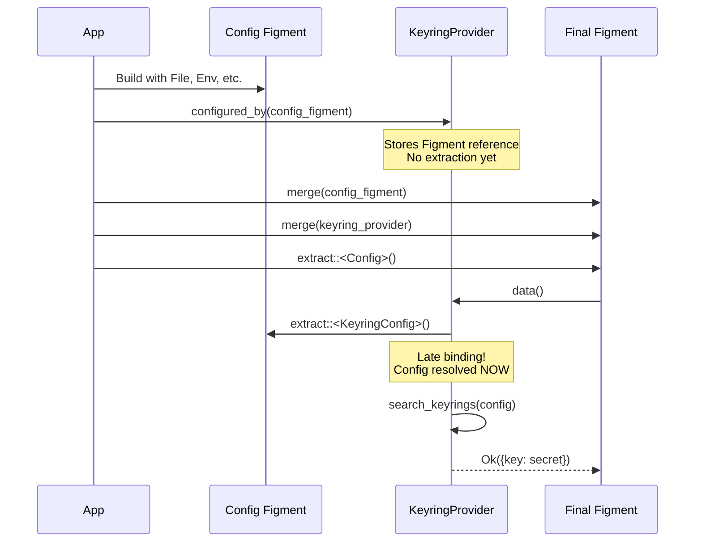
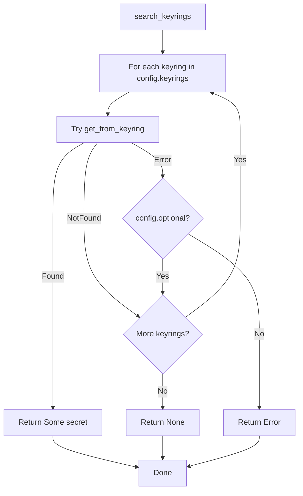
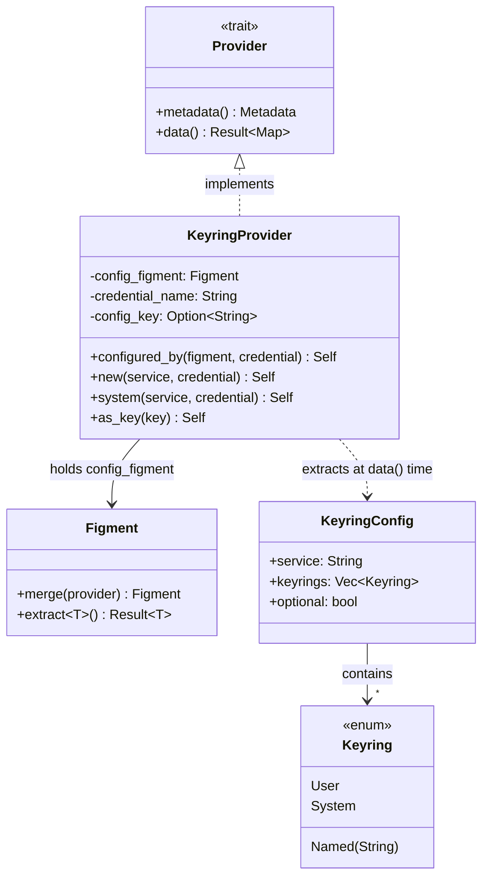
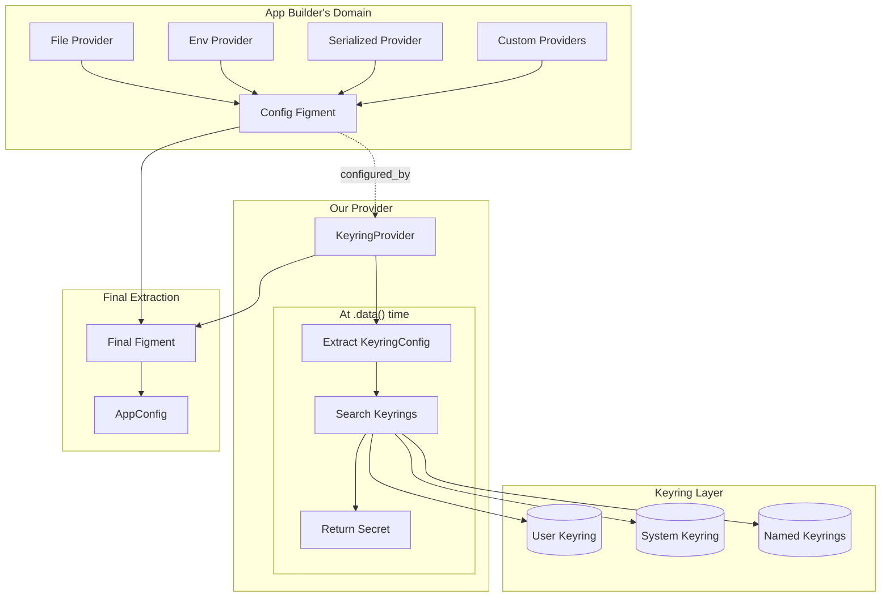
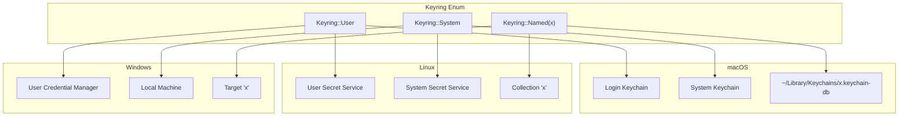
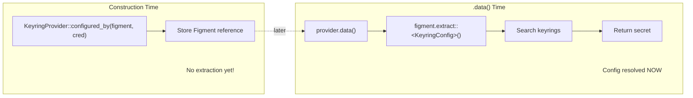

# Figment Keyring Provider - Revised Design v3

**Author**: Claude (opus)  
**Based on**: Cross-review synthesis + author critique  
**Status**: Draft v3

---

## Problem Statement

Applications need secure storage for sensitive configuration. This provider bridges Figment2's layered configuration with system keyring storage.

**Core requirement**:
> App builders use whatever layered Figment config they want to drive our keyring provider.

This means:
1. User builds Figment with any layers (File, Env, Serialized, custom providers)
2. That same Figment configures our keyring provider
3. **We don't dictate the source** - no hardcoded file paths or env var names
4. **Late binding** - configuration is resolved when secrets are fetched, not when provider is created

---

## Design Philosophy

### The Key Insight

The provider holds a reference to the user's Figment and extracts configuration at `.data()` time:



### Why This Matters

- **App builder controls everything**: They choose File, Env, Serialized, custom providers
- **We're agnostic**: We just receive a Figment, don't care how it was built
- **Late binding**: Config extracted when secrets are actually needed
- **Dynamic**: Config sources can change between calls

---

## Core Types

### Keyring Enum

```rust
/// Identifies which keyring to use.
#[derive(Clone, Debug, PartialEq, Eq, Deserialize, Serialize)]
#[serde(rename_all = "lowercase")]
pub enum Keyring {
    /// Current user's keyring (default)
    User,
    /// System-wide keyring
    System,
    /// Custom named keyring
    #[serde(untagged)]
    Named(String),
}

impl Default for Keyring {
    fn default() -> Self {
        Keyring::User
    }
}

impl From<&str> for Keyring {
    fn from(s: &str) -> Self {
        match s {
            "user" => Keyring::User,
            "system" => Keyring::System,
            name => Keyring::Named(name.into()),
        }
    }
}
```

### KeyringConfig

```rust
/// Configuration for keyring behavior.
/// Deserializable from any Figment source.
#[derive(Clone, Debug, Deserialize, Serialize)]
pub struct KeyringConfig {
    /// Application/service identifier for keyring entries
    pub service: String,
    
    /// Keyrings to search, in priority order.
    /// First keyring with the entry wins.
    #[serde(default = "default_keyrings")]
    pub keyrings: Vec<Keyring>,
    
    /// Don't fail if secret is not found in any keyring
    #[serde(default)]
    pub optional: bool,
}

fn default_keyrings() -> Vec<Keyring> {
    vec![Keyring::User]
}
```

### Keyring Search Flow



---

## KeyringProvider API

### The Primary Constructor

```rust
pub struct KeyringProvider {
    /// Figment that provides our KeyringConfig.
    /// Extracted at .data() time for late binding.
    config_figment: Figment,
    
    /// Which credential to fetch from the keyring
    credential_name: String,
    
    /// Override the config key name (defaults to credential_name)
    config_key: Option<String>,
    
    /// Override profile (defaults to Profile::Default)
    profile: Option<Profile>,
}

impl KeyringProvider {
    /// Create a provider configured by the given Figment.
    /// 
    /// The Figment should contain a `KeyringConfig` (or fields that
    /// deserialize into one). Config is extracted at `.data()` time,
    /// enabling late binding.
    /// 
    /// # Example
    /// 
    /// ```rust
    /// // App builder uses whatever Figment layers they want
    /// let config = Figment::new()
    ///     .merge(File::from("config.toml"))
    ///     .merge(Env::prefixed("MYAPP_"));
    /// 
    /// // Our provider uses that config
    /// let provider = KeyringProvider::configured_by(config, "api_key");
    /// ```
    pub fn configured_by(config_figment: Figment, credential_name: &str) -> Self {
        Self {
            config_figment,
            credential_name: credential_name.into(),
            config_key: None,
            profile: None,
        }
    }
    
    /// Map keyring entry to a different config key name.
    pub fn as_key(mut self, key: &str) -> Self {
        self.config_key = Some(key.into());
        self
    }
    
    /// Target a specific Figment profile.
    pub fn with_profile(mut self, profile: Profile) -> Self {
        self.profile = Some(profile);
        self
    }
}
```

### Simple Constructors for Common Cases

```rust
impl KeyringProvider {
    /// Simple constructor: user keyring, service name, credential name.
    /// For when you don't need Figment-driven configuration.
    pub fn new(service: &str, credential_name: &str) -> Self {
        // Build a minimal Figment with just the defaults
        let config = KeyringConfig {
            service: service.into(),
            keyrings: vec![Keyring::User],
            optional: false,
        };
        let figment = Figment::from(Serialized::defaults(config));
        Self::configured_by(figment, credential_name)
    }
    
    /// Use system keyring instead of user keyring.
    pub fn system(service: &str, credential_name: &str) -> Self {
        let config = KeyringConfig {
            service: service.into(),
            keyrings: vec![Keyring::System],
            optional: false,
        };
        let figment = Figment::from(Serialized::defaults(config));
        Self::configured_by(figment, credential_name)
    }
}
```

### Provider Implementation

```rust
impl Provider for KeyringProvider {
    fn metadata(&self) -> Metadata {
        Metadata::named("keyring")
    }
    
    fn data(&self) -> Result<Map<Profile, Dict>, Error> {
        // LATE BINDING: Extract config NOW, not at construction
        let config: KeyringConfig = self.config_figment.extract()
            .map_err(|e| Error::from(format!("keyring config: {}", e)))?;
        
        // Search keyrings in priority order
        let secret = self.search_keyrings(&config)?;
        
        // Determine the config key to use
        let key = self.config_key.as_ref()
            .unwrap_or(&self.credential_name);
        
        // Build result
        let profile = self.profile.clone().unwrap_or(Profile::Default);
        let mut dict = Dict::new();
        
        match secret {
            Some(value) => {
                dict.insert(key.clone(), Value::from(value));
            }
            None if config.optional => {
                // Optional and not found: return empty
            }
            None => {
                return Err(Error::from(format!(
                    "secret '{}' not found in any keyring", 
                    self.credential_name
                )));
            }
        }
        
        let mut map = Map::new();
        map.insert(profile, dict);
        Ok(map)
    }
}

impl KeyringProvider {
    fn search_keyrings(&self, config: &KeyringConfig) -> Result<Option<String>, Error> {
        for keyring in &config.keyrings {
            match self.get_from_keyring(keyring, &config.service) {
                Ok(secret) => return Ok(Some(secret)),
                Err(KeyringError::NotFound) => continue,
                Err(e) => {
                    if config.optional {
                        continue;
                    } else {
                        return Err(e.into());
                    }
                }
            }
        }
        Ok(None)
    }
    
    fn get_from_keyring(&self, keyring: &Keyring, service: &str) -> Result<String, KeyringError> {
        // Platform-specific keyring access
        todo!()
    }
}
```

---

## Usage Patterns

### Pattern 1: Full Figment Control (Primary Use Case)

App builder uses whatever Figment layers they want:

```rust
// App builder creates their Figment with any layers
let config_figment = Figment::new()
    .merge(File::from("base.toml"))
    .merge(File::from("local.toml"))
    .merge(Env::prefixed("MYAPP_"))
    .merge(Serialized::defaults(MyDefaults::new()));

// Keyring provider is configured by that Figment
let api_key_provider = KeyringProvider::configured_by(
    config_figment.clone(), 
    "api_key"
);
let db_password_provider = KeyringProvider::configured_by(
    config_figment.clone(), 
    "database_password"
);

// Final Figment merges everything
let app_config: AppConfig = Figment::new()
    .merge(config_figment)       // All non-secret config
    .merge(api_key_provider)     // Secret from keyring
    .merge(db_password_provider) // Another secret
    .extract()?;
```

Config file:

```toml
# config.toml
service = "myapp"
keyrings = ["user", "team-secrets", "system"]
optional = false

# Other app config
database_host = "localhost"
debug = true
```

### Pattern 2: Simple Usage

For apps that don't need Figment-driven keyring config:

```rust
let config: Config = Figment::new()
    .merge(File::from("config.toml"))
    .merge(KeyringProvider::new("myapp", "api_key"))
    .merge(Env::prefixed("MYAPP_"))
    .extract()?;
```

### Pattern 3: Environment-Driven Deployment

Same code works across environments by changing config:

```rust
// Code is the same everywhere
let config_figment = Figment::new()
    .merge(File::from("config.toml"))
    .merge(Env::prefixed("MYAPP_"));

let provider = KeyringProvider::configured_by(config_figment.clone(), "api_key");

let config: Config = Figment::new()
    .merge(config_figment)
    .merge(provider)
    .extract()?;
```

Development config:
```toml
# config.toml (development)
service = "myapp"
keyrings = ["user"]
```

Production config:
```toml
# config.toml (production)
service = "myapp-prod"
keyrings = ["system"]
```

Or override via environment:
```bash
# Override keyring selection
export MYAPP_KEYRINGS='["system"]'
export MYAPP_SERVICE="myapp-prod"
```

### Pattern 4: Team/Project Keyrings

```toml
# config.toml
service = "myapp"
keyrings = ["user", "team-alpha", "org-shared", "system"]
optional = true
```

Search order: user's personal keyring → team keyring → org keyring → system keyring.

---

## Architecture Diagram



## Data Flow



---

## Configuration Schema

### TOML

```toml
# Anywhere in your Figment-configured files

# Required: service/application name for keyring entries
service = "myapp"

# Optional: keyrings to search (default: ["user"])
keyrings = ["user", "team-secrets", "system"]

# Optional: don't fail if not found (default: false)
optional = true
```

### As Nested Config

```toml
# config.toml
[keyring]
service = "myapp"
keyrings = ["user", "team-secrets"]

[database]
host = "localhost"
port = 5432
```

To use nested config, extract with a wrapper:

```rust
#[derive(Deserialize)]
struct FullConfig {
    keyring: KeyringConfig,
    database: DatabaseConfig,
}

// Or use Figment's focus feature
let keyring_figment = config_figment.focus("keyring");
let provider = KeyringProvider::configured_by(keyring_figment, "api_key");
```

### Environment Variables

```bash
# Direct
export SERVICE="myapp"
export KEYRINGS='["user", "system"]'
export OPTIONAL="true"

# With prefix (if using Env::prefixed)
export MYAPP_SERVICE="myapp"
export MYAPP_KEYRINGS='["user", "system"]'
```

---

## Platform Keyring Mapping



| `Keyring` variant | macOS | Linux | Windows |
|-------------------|-------|-------|---------|
| `User` | Login Keychain | User's Secret Service | User's Credential Manager |
| `System` | System Keychain | System Secret Service | Local Machine credentials |
| `Named(x)` | Keychain `x.keychain-db` | Collection `x` | Target `x` |

---

## Error Handling

```rust
#[derive(Debug, thiserror::Error)]
pub enum KeyringError {
    #[error("secret not found in any keyring")]
    NotFound,
    
    #[error("keyring config error: {0}")]
    ConfigError(String),
    
    #[error("keyring service unavailable: {0}")]
    ServiceUnavailable(String),
    
    #[error("permission denied")]
    PermissionDenied,
    
    #[error("backend error: {0}")]
    BackendError(String),
}
```

---

## Why This Design Works

### 1. App Builder Has Full Control

They build whatever Figment they want:

```rust
// Their choice of layers
let config = Figment::new()
    .merge(File::from("defaults.toml"))
    .merge(File::from(format!("{}.toml", env)))
    .merge(Env::prefixed("MYAPP_"))
    .merge(Serialized::defaults(cli_args));
```

### 2. We're Agnostic to Source

We just receive a Figment. Don't care if it came from file, env, or custom provider:

```rust
let provider = KeyringProvider::configured_by(their_figment, "api_key");
```

### 3. True Late Binding

Config is extracted at `.data()` time:



```rust
impl Provider for KeyringProvider {
    fn data(&self) -> Result<...> {
        let config = self.config_figment.extract()?; // NOW
        // ...
    }
}
```

### 4. Dynamic Reconfiguration

If underlying sources change between calls, provider sees new config:

```rust
// First extraction uses current config
let config1: Config = figment.extract()?;

// Config file is updated externally...

// Second extraction sees new config
let config2: Config = figment.extract()?;
```

---

## Open Questions

1. **Figment cloning**: Should we clone or reference the config Figment?

2. **Caching**: Should we cache the extracted `KeyringConfig` within a single `.data()` call, or re-extract for each secret?

3. **Focused extraction**: Should we support `configured_by(figment.focus("keyring"), ...)` for nested config?

4. **Profile-aware config**: Should `KeyringConfig` vary by Figment profile?

---

## Implementation Checklist

### P0 (Required for v0.1)

- [ ] `Keyring` enum with serde support
- [ ] `KeyringConfig` struct with serde support
- [ ] `KeyringProvider::configured_by(figment, credential)`
- [ ] Late-binding `.data()` implementation
- [ ] Keyring search in priority order
- [ ] `KeyringProvider::new()` for simple cases
- [ ] `.as_key()` builder

### P1 (Should have)

- [ ] `KeyringProvider::system()` convenience
- [ ] Platform keyring implementations
- [ ] Error types with Figment mapping
- [ ] Documentation with examples

### P2 (Nice to have)

- [ ] `Figment::focus()` support for nested config
- [ ] Profile-aware configuration
- [ ] Keyring change watching

---

## Conclusion

This design achieves the core requirement:

> App builders use whatever layered Figment config they want to drive our keyring provider.

The key is `configured_by(figment)`:
- **User provides any Figment** they've built with their choice of layers
- **We extract at `.data()` time** for true late binding
- **No hardcoded sources** - we're agnostic to how the Figment was built
- **Dynamic** - config changes are reflected in subsequent extractions
