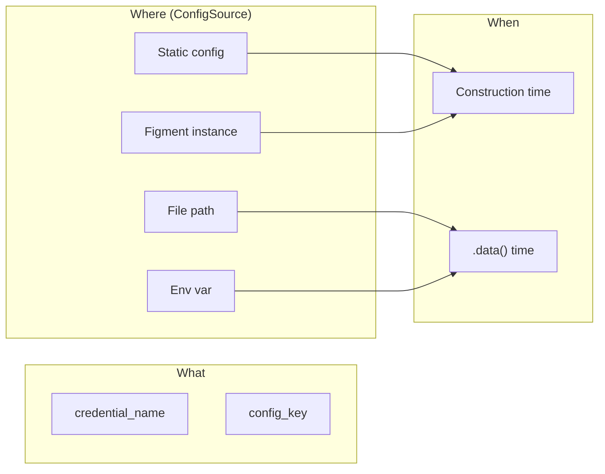
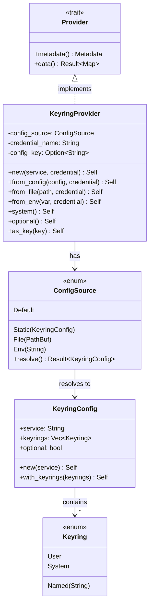
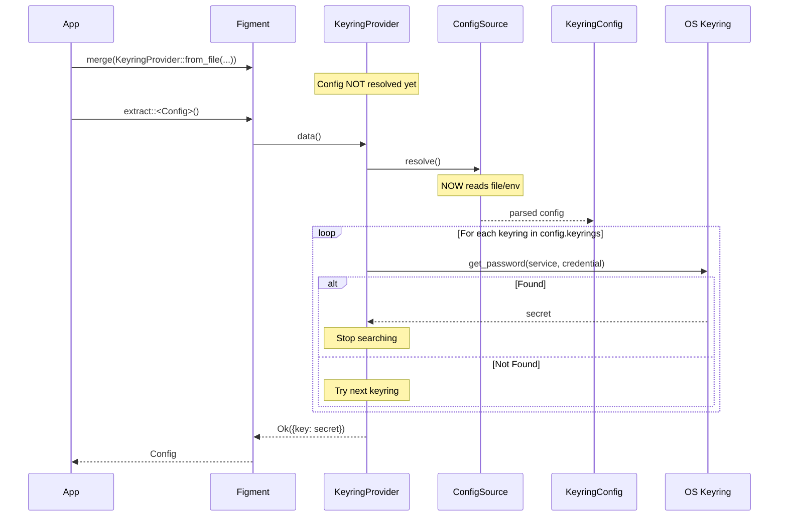
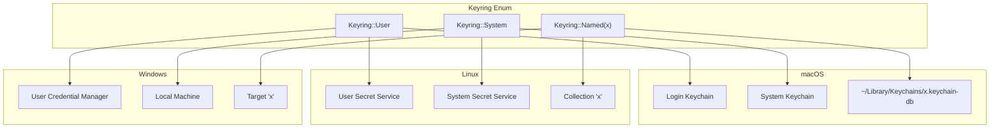

# Figment Keyring Provider - Revised Design v3

**Author**: Claude (opus)  
**Based on**: Cross-review synthesis + author critique + GLM review  
**Status**: Draft v3

---

## Problem Statement

Applications need secure storage for sensitive configuration: API keys, tokens, database passwords. This provider bridges Figment2's layered configuration with system keyring storage.

**Key requirements from author critique**:
1. Support multiple keyrings (user, system, named)
2. Use Figment to configure which keyrings to search
3. User and system keyrings as special easy-to-use options
4. Default to user keyring only
5. **Late binding**: defer configuration resolution as long as possible
6. **Dynamic behavior**: configuration can change even at runtime

---

## Design Philosophy

### Separation of Concerns

The design separates three orthogonal concerns:

1. **What to fetch**: credential name, config key mapping
2. **Where to get keyring config**: static, file, env, or Figment-based
3. **When to resolve config**: construction time vs `.data()` time



### Late Binding Priority

The design prioritizes late binding—resolving configuration as late as possible enables:
- Configuration changes without restarting the application
- Same provider working across different environments
- Testing with different configs without rebuilding providers

---

## Core Types

### Keyring Enum

```rust
/// Identifies which keyring to use.
#[derive(Clone, Debug, PartialEq, Eq, Deserialize, Serialize)]
#[serde(rename_all = "lowercase")]
pub enum Keyring {
    /// Current user's keyring (default)
    User,
    /// System-wide keyring
    System,
    /// Custom named keyring
    #[serde(untagged)]
    Named(String),
}

impl Default for Keyring {
    fn default() -> Self {
        Keyring::User
    }
}

impl From<&str> for Keyring {
    fn from(s: &str) -> Self {
        match s {
            "user" => Keyring::User,
            "system" => Keyring::System,
            name => Keyring::Named(name.into()),
        }
    }
}
```

### KeyringConfig

```rust
/// Configuration for keyring behavior.
/// Can be deserialized from Figment, TOML, JSON, env vars, etc.
#[derive(Clone, Debug, Deserialize, Serialize)]
pub struct KeyringConfig {
    /// Application/service identifier
    pub service: String,
    
    /// Keyrings to search, in priority order
    #[serde(default = "default_keyrings")]
    pub keyrings: Vec<Keyring>,
    
    /// Don't fail if secret is not found
    #[serde(default)]
    pub optional: bool,
}

fn default_keyrings() -> Vec<Keyring> {
    vec![Keyring::User]
}

impl KeyringConfig {
    pub fn new(service: impl Into<String>) -> Self {
        Self {
            service: service.into(),
            keyrings: default_keyrings(),
            optional: false,
        }
    }
    
    pub fn with_keyrings(mut self, keyrings: Vec<Keyring>) -> Self {
        self.keyrings = keyrings;
        self
    }
    
    pub fn optional(mut self) -> Self {
        self.optional = true;
        self
    }
}
```

### ConfigSource - The Key to Late Binding

```rust
/// Where to get keyring configuration from.
/// Determines WHEN configuration is resolved.
#[derive(Clone, Debug)]
pub enum ConfigSource {
    /// Configuration is known now (resolved at construction)
    Static(KeyringConfig),
    
    /// Read from TOML/JSON file at .data() time
    File(PathBuf),
    
    /// Read from environment variable at .data() time
    /// Variable should contain JSON or "service:keyring1,keyring2" format
    Env(String),
    
    /// Use defaults with just a service name
    Default { service: String },
}

impl ConfigSource {
    /// Resolve configuration. Called at .data() time for late-bound sources.
    fn resolve(&self) -> Result<KeyringConfig, Error> {
        match self {
            ConfigSource::Static(config) => Ok(config.clone()),
            
            ConfigSource::File(path) => {
                let contents = std::fs::read_to_string(path)?;
                let config: KeyringConfig = toml::from_str(&contents)?;
                Ok(config)
            }
            
            ConfigSource::Env(var_name) => {
                let value = std::env::var(var_name)?;
                parse_env_config(&value)
            }
            
            ConfigSource::Default { service } => {
                Ok(KeyringConfig::new(service))
            }
        }
    }
}
```

---

## KeyringProvider API

### Construction Patterns

```rust
pub struct KeyringProvider {
    config_source: ConfigSource,
    credential_name: String,
    config_key: Option<String>,
    profile: Option<Profile>,
}

impl KeyringProvider {
    // === Simple construction (most common) ===
    
    /// User keyring, default settings
    pub fn new(service: &str, credential_name: &str) -> Self {
        Self {
            config_source: ConfigSource::Default { service: service.into() },
            credential_name: credential_name.into(),
            config_key: None,
            profile: None,
        }
    }
    
    // === Static configuration ===
    
    /// Use explicit KeyringConfig (resolved now)
    pub fn from_config(config: KeyringConfig, credential_name: &str) -> Self {
        Self {
            config_source: ConfigSource::Static(config),
            credential_name: credential_name.into(),
            config_key: None,
            profile: None,
        }
    }
    
    // === Late-bound configuration ===
    
    /// Read config from file at .data() time
    pub fn from_file(path: impl Into<PathBuf>, credential_name: &str) -> Self {
        Self {
            config_source: ConfigSource::File(path.into()),
            credential_name: credential_name.into(),
            config_key: None,
            profile: None,
        }
    }
    
    /// Read config from env var at .data() time
    pub fn from_env(env_var: &str, credential_name: &str) -> Self {
        Self {
            config_source: ConfigSource::Env(env_var.into()),
            credential_name: credential_name.into(),
            config_key: None,
            profile: None,
        }
    }
    
    // === Builders ===
    
    /// Override which keyrings to search
    pub fn keyrings(mut self, keyrings: Vec<Keyring>) -> Self {
        self.config_source = match self.config_source {
            ConfigSource::Static(mut config) => {
                config.keyrings = keyrings;
                ConfigSource::Static(config)
            }
            ConfigSource::Default { service } => {
                ConfigSource::Static(KeyringConfig {
                    service,
                    keyrings,
                    optional: false,
                })
            }
            // Can't override late-bound sources at construction
            other => other,
        };
        self
    }
    
    /// Use system keyring instead of user
    pub fn system(self) -> Self {
        self.keyrings(vec![Keyring::System])
    }
    
    /// Add a named keyring to search
    pub fn also_named(mut self, name: impl Into<String>) -> Self {
        // Modifies keyrings list to add named keyring
        self.keyrings(self.current_keyrings_plus(Keyring::Named(name.into())))
    }
    
    /// Map to different config key name
    pub fn as_key(mut self, key: &str) -> Self {
        self.config_key = Some(key.into());
        self
    }
    
    /// Don't fail if secret not found
    pub fn optional(mut self) -> Self {
        self.config_source = match self.config_source {
            ConfigSource::Static(mut config) => {
                config.optional = true;
                ConfigSource::Static(config)
            }
            other => other,
        };
        self
    }
    
    /// Target specific Figment profile
    pub fn with_profile(mut self, profile: Profile) -> Self {
        self.profile = Some(profile);
        self
    }
}
```

### Provider Implementation

```rust
impl Provider for KeyringProvider {
    fn metadata(&self) -> Metadata {
        Metadata::named("keyring")
    }
    
    fn data(&self) -> Result<Map<Profile, Dict>, Error> {
        // Late binding: resolve config NOW
        let config = self.config_source.resolve()?;
        
        // Search keyrings in order
        let secret = self.search_keyrings(&config)?;
        
        // Build result map
        let key = self.config_key.as_ref()
            .unwrap_or(&self.credential_name);
        
        let profile = self.profile.clone()
            .unwrap_or(Profile::Default);
        
        let mut dict = Dict::new();
        if let Some(value) = secret {
            dict.insert(key.clone(), Value::from(value));
        }
        
        let mut map = Map::new();
        map.insert(profile, dict);
        Ok(map)
    }
}
```

---

## Usage Patterns

### Pattern 1: Simple (Most Common)

```rust
// User keyring, single secret
let config: Config = Figment::new()
    .merge(File::from("config.toml"))
    .merge(KeyringProvider::new("myapp", "api_key"))
    .merge(Env::prefixed("MYAPP_"))
    .extract()?;
```

### Pattern 2: Static Configuration

```rust
// Explicit config, resolved at construction
let keyring_config = KeyringConfig::new("myapp")
    .with_keyrings(vec![Keyring::User, Keyring::Named("team".into())])
    .optional();

let config: Config = Figment::new()
    .merge(KeyringProvider::from_config(keyring_config, "api_key"))
    .extract()?;
```

### Pattern 3: Figment-Configured (Two-Phase)

```rust
// Phase 1: Extract keyring configuration from Figment
let keyring_config: KeyringConfig = Figment::new()
    .merge(File::from("config.toml"))
    .extract()?;

// Phase 2: Use config to build provider
let config: Config = Figment::new()
    .merge(File::from("config.toml"))
    .merge(KeyringProvider::from_config(keyring_config, "api_key"))
    .extract()?;
```

### Pattern 4: Late-Bound File Configuration

```rust
// Config is read from file at .data() time
// File can change between calls!
let provider = KeyringProvider::from_file("keyring.toml", "api_key");

let config: Config = Figment::new()
    .merge(provider)
    .extract()?;
```

```toml
# keyring.toml - can be updated without restarting app
service = "myapp"
keyrings = ["user", "team-secrets", "system"]
optional = true
```

### Pattern 5: Environment-Driven

```rust
// Config determined by environment at .data() time
let provider = KeyringProvider::from_env("MYAPP_KEYRING_CONFIG", "api_key");

// MYAPP_KEYRING_CONFIG=myapp:user,team-secrets
// or
// MYAPP_KEYRING_CONFIG={"service":"myapp","keyrings":["user","system"]}
```

### Pattern 6: Multi-Secret with Shared Config

```rust
let keyring_config = KeyringConfig::new("myapp")
    .with_keyrings(vec![Keyring::User, Keyring::System]);

let config: Config = Figment::new()
    .merge(File::from("config.toml"))
    .merge(KeyringProvider::from_config(keyring_config.clone(), "api_key"))
    .merge(KeyringProvider::from_config(keyring_config.clone(), "db_password"))
    .merge(KeyringProvider::from_config(keyring_config, "jwt_secret"))
    .extract()?;
```

---

## Configuration File Format

### TOML

```toml
# keyring.toml or [keyring] section in config.toml
service = "myapp"
keyrings = ["user", "team-secrets", "system"]
optional = false

# Named keyring details (future enhancement)
[named.team-secrets]
collection = "dev-team"
```

### JSON

```json
{
  "service": "myapp",
  "keyrings": ["user", "system"],
  "optional": true
}
```

### Environment Variable

```bash
# Simple format
MYAPP_KEYRING_CONFIG="myapp:user,team-secrets,system"

# JSON format
MYAPP_KEYRING_CONFIG='{"service":"myapp","keyrings":["user"]}'
```

---

## Architecture Diagram



## Late Binding Flow



## Platform Keyring Mapping



---

## Error Handling

```rust
#[derive(Debug, thiserror::Error)]
pub enum KeyringError {
    #[error("secret not found in any keyring")]
    NotFound,
    
    #[error("keyring service unavailable: {0}")]
    ServiceUnavailable(String),
    
    #[error("permission denied accessing keyring")]
    PermissionDenied,
    
    #[error("failed to read config: {0}")]
    ConfigError(String),
    
    #[error("keyring backend error: {0}")]
    BackendError(String),
}
```

For optional providers, `NotFound` and `ServiceUnavailable` return empty data instead of errors.

---

## Comparison: GLM vs This Design

| Aspect | GLM Design | This Design |
|--------|------------|-------------|
| Config extraction | Hidden in `from_figment()` | Explicit (`from_config`) or late (`from_file`) |
| Late binding | No | Yes, via `ConfigSource::File/Env` |
| When config resolved | Construction time | `.data()` time for late-bound |
| API clarity | Confusing (Figment + service) | Clear separation |
| Two-phase loading | Always required | Optional (only for Figment-configured) |
| Dynamic reconfiguration | No | Yes, with File/Env sources |
| Config struct | Internal | Public, reusable |

---

## Testing Strategy

```rust
#[cfg(test)]
mod tests {
    use super::*;
    
    #[test]
    fn static_config_resolves_immediately() {
        let config = KeyringConfig::new("myapp")
            .with_keyrings(vec![Keyring::User]);
        
        let provider = KeyringProvider::from_config(config, "api_key");
        // Config is already resolved, no file/env access needed
    }
    
    #[test]
    fn file_config_resolves_at_data_time() {
        // Write test config
        std::fs::write("test_keyring.toml", r#"
            service = "testapp"
            keyrings = ["user"]
        "#).unwrap();
        
        let provider = KeyringProvider::from_file("test_keyring.toml", "api_key");
        
        // Config not resolved yet
        // Would be resolved when .data() is called
    }
    
    #[test]
    fn env_config_resolves_at_data_time() {
        std::env::set_var("TEST_KEYRING", "testapp:user,system");
        
        let provider = KeyringProvider::from_env("TEST_KEYRING", "api_key");
        
        // Config not resolved yet
        // Would be resolved when .data() is called
    }
}
```

---

## Open Questions

1. **Config caching**: Should late-bound sources cache their config, or re-read every `.data()` call?

2. **Config validation**: Should `from_file` validate the file exists at construction, or only at `.data()`?

3. **Figment ConfigSource**: Should there be a `ConfigSource::Figment(Figment)` that extracts at `.data()` time? This would enable true single-Figment usage but adds complexity.

4. **Watch for changes**: Should file-based config support watching for changes and automatically reconfiguring?

---

## Implementation Checklist

### P0 (Required for v0.1)

- [ ] `Keyring` enum (User, System, Named) with serde support
- [ ] `KeyringConfig` struct with serde support
- [ ] `ConfigSource` enum with `resolve()` method
- [ ] `KeyringProvider::new()` for simple case
- [ ] `KeyringProvider::from_config()` for static config
- [ ] `KeyringProvider::from_file()` for late-bound file config
- [ ] `KeyringProvider::from_env()` for late-bound env config
- [ ] `.system()`, `.optional()`, `.as_key()` builders
- [ ] Provider trait implementation with late-bound resolution
- [ ] Error types with proper Figment mapping

### P1 (Should have for v0.1)

- [ ] `.also_named()` for adding named keyrings
- [ ] Environment variable parsing (simple and JSON formats)
- [ ] Platform keyring mapping documentation
- [ ] Headless environment documentation

### P2 (Nice to have)

- [ ] Config file watching for dynamic updates
- [ ] `ConfigSource::Figment` for single-Figment late binding
- [ ] Performance benchmarks

---

## Conclusion

This design achieves the author's requirements:

1. ✅ **Multiple keyring support**: User, System, Named via `Keyring` enum
2. ✅ **Figment-configured**: `KeyringConfig` is deserializable, works with any Figment source
3. ✅ **Easy user/system selection**: `.system()` builder, defaults to user
4. ✅ **Late binding**: `ConfigSource::File/Env` resolve at `.data()` time
5. ✅ **Dynamic behavior**: File-based config can change between calls

The key insight is separating **what** (credential), **where** (config source), and **when** (resolution time). This enables both simple static usage and advanced late-bound dynamic configuration.
